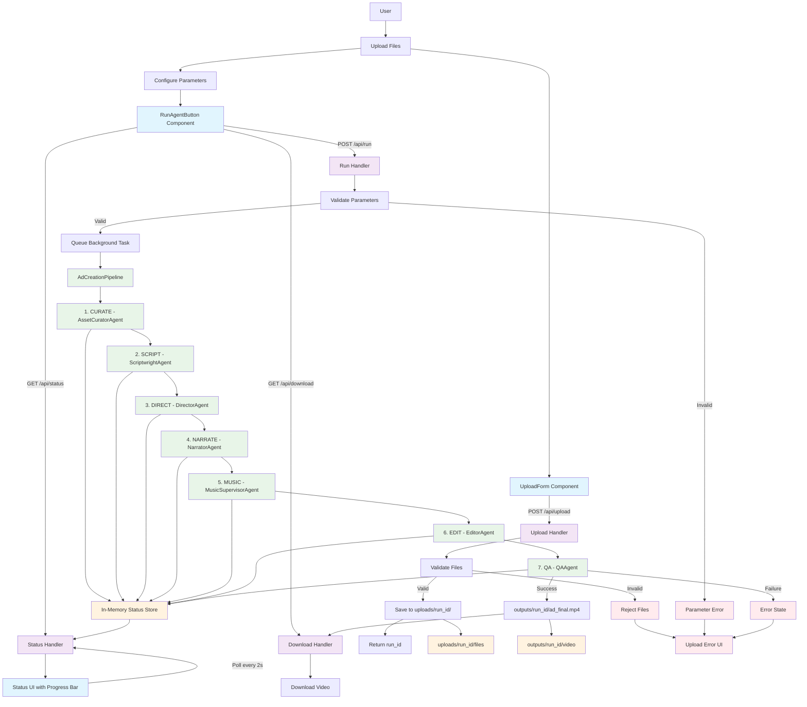

# CrewAd

🎬 **AI-native ad studio**: Transform your folder of images into compelling video ads with AI.

Upload still images, optional logo, optional audio, and a brief style description. Our CrewAI-style multi-agent pipeline validates assets, drafts scripts, maps sentences to images, generates voiceover with Kokoro TTS, applies Ken Burns motion effects, and renders a final MP4.

## ✨ Features

- **Drag & Drop Upload**: Simple web interface for single or multiple file uploads
- **AI Script Generation**: Creates compelling ad copy based on your brief and target specifications  
- **Smart Asset Mapping**: Intelligently maps script lines to visual assets
- **Multi-TTS Support**: Kokoro-82M TTS (default) with espeak-ng fallback
- **Ken Burns Effects**: Professional motion graphics for static images
- **Real-time Pipeline Status**: Live updates as your ad is being generated
- **Multiple Aspect Ratios**: 16:9, 9:16, and 1:1 support
- **RAG-Enhanced Copywriting**: Style guidance system for brand-safe content

## 🚀 Quick Start

### Prerequisites

**Python 3.11 (Required for compatibility)**
- Download Python 3.11 from [python.org](https://www.python.org/downloads/)
- **Note**: Python 3.13+ has compatibility issues with some packages

**System Dependencies:**
- **ffmpeg** installed and accessible in PATH
- **espeak-ng** installed (for TTS fallback)

#### Installing System Dependencies

**Windows (Chocolatey):**
```cmd
choco install ffmpeg
choco install espeak-ng
```

**Windows (Manual):**
- Download ffmpeg from https://ffmpeg.org/download.html
- Download espeak-ng from https://github.com/espeak-ng/espeak-ng/releases
- Add both to your system PATH

**macOS (Homebrew):**
```bash
brew install ffmpeg espeak-ng
```

**Ubuntu/Debian:**
```bash
sudo apt update
sudo apt install ffmpeg espeak-ng
```

### Backend Setup

1. **Clone and navigate to the project:**
```bash
git clone https://github.com/ortall0201/CrewAd.git
cd CrewAd/folder-in-ad-out/backend
```

2. **Create virtual environment with Python 3.11:**
```bash
python3.11 -m venv .venv
# or on Windows: py -3.11 -m venv .venv
```

3. **Activate virtual environment:**
```bash
# On macOS/Linux:
source .venv/bin/activate

# On Windows (Git Bash):
source .venv/Scripts/activate

# On Windows (Command Prompt):
.venv\Scripts\activate
```

4. **Install Python dependencies:**
```bash
pip install --upgrade pip
pip install -r requirements.txt
```

5. **Configure environment (optional):**
```bash
cp .env.template .env
# Edit .env if you want to customize settings
```

6. **Start the backend server:**
```bash
uvicorn src.main:app --reload --host 0.0.0.0 --port 8000
```

The API will be available at `http://localhost:8000`

### Frontend Setup

1. **Navigate to frontend directory:**
```bash
cd ../frontend
```

2. **Serve the frontend:**

**Option A - Using Python (simple):**
```bash
python -m http.server 3000
```

**Option B - Using Node.js (if you have it):**
```bash
npx serve -s . -p 3000
```

The frontend will be available at `http://localhost:3000`

## 📋 Usage

### Step 1: Upload Assets
- Upload **single files** or **multiple files** (no need for folders)
- **Supported formats:**
  - **Images**: JPG, PNG, WebP, GIF, BMP
  - **Audio**: WAV, MP3, M4A, AAC, OGG  
  - **Text**: TXT, MD, JSON (for briefs/style guides)
- Files are automatically categorized (images, logos, audio, briefs)

### Step 2: Configure Generation
- **Target Length**: 5-120 seconds
- **Tone**: Confident, Friendly, Professional, Casual, Urgent, Calm
- **Aspect Ratio**: 16:9 (landscape), 9:16 (portrait), 1:1 (square)

### Step 3: Generate & Download
- Click "Generate Ad" to start the pipeline
- Monitor real-time progress through 7 pipeline stages
- Download your finished MP4 when complete

## 🔧 Pipeline Flow & Architecture

### Complete User Journey

This Mermaid diagram illustrates the complete user journey from file upload to video download:



### Pipeline Stages Breakdown

The AI pipeline consists of 7 specialized stages:

1. **Asset Curation** - Asset validation, categorization, and organization
2. **Script Generation** - RAG-enhanced ad copy generation based on tone/length parameters
3. **Storyboard Creation** - Intelligent storyboard creation with Ken Burns motion planning
4. **Voice Synthesis** - Voice synthesis using Kokoro TTS with espeak-ng fallback
5. **Music Supervision** - Background audio supervision (MVP placeholder)
6. **Video Rendering** - Professional video composition using MoviePy and ffmpeg
7. **Quality Assurance** - Output validation and metadata generation

### System Architecture Layers

#### Frontend Layer (Blue)
- **UploadForm Component**: Handles single/multiple file uploads with auto-categorization
- **RunAgentButton Component**: Manages pipeline configuration and real-time status monitoring
- **Status UI**: Real-time progress tracking with 2-second polling intervals

#### API Layer (Purple)
- **Upload Handler**: File validation, categorization, and run_id generation
- **Run Handler**: Parameter validation and background task queuing
- **Status Handler**: Thread-safe pipeline status updates
- **Download Handler**: Final MP4 video delivery

#### Pipeline Layer (Green)
7-stage AI-powered ad creation using specialized CrewAI agents with asynchronous processing and real-time status updates.

#### Storage Layer (Orange)
- **uploads/{run_id}/**: User-provided assets (images, logos, audio, briefs)
- **outputs/{run_id}/**: Generated videos with metadata
- **In-Memory Status Store**: Thread-safe concurrent pipeline status tracking

#### Error Handling (Red)
- File type validation and graceful failure recovery
- Parameter validation with user-friendly error messages
- Pipeline failure recovery with detailed logging

## 🛠️ Development

### VS Code Setup (Python 3.11)
1. Open VS Code in the project directory
2. Press `Ctrl+Shift+P` → "Python: Select Interpreter"
3. Choose: `./folder-in-ad-out/backend/.venv/Scripts/python.exe`
4. This will resolve all import issues in Pylance

### Running Tests
```bash
cd folder-in-ad-out/backend
pytest
```

### API Documentation
Once the backend is running, visit:
- Swagger UI: `http://localhost:8000/docs`
- ReDoc: `http://localhost:8000/redoc`

## 🔍 Troubleshooting

### Common Issues

**"ffmpeg not found"**
- Ensure ffmpeg is installed and in your system PATH
- Test with: `ffmpeg -version`

**"espeak-ng not found"**  
- Install espeak-ng for TTS fallback support
- Test with: `espeak-ng --version`

**Python import errors in VS Code**
- Make sure you're using Python 3.11 virtual environment
- Select correct Python interpreter: `Ctrl+Shift+P` → "Python: Select Interpreter"
- Reload window: `Ctrl+Shift+P` → "Developer: Reload Window"

**Upload errors or 501 status**
- Ensure backend is running on port 8000
- Check that frontend is calling `localhost:8000/api/*` endpoints
- Clear browser cache if needed

**ChromaDB/NumPy compatibility issues**
- The requirements.txt pins numpy==1.26.4 for ChromaDB compatibility
- Don't upgrade to numpy 2.x

## 🏗️ Architecture

```
/CrewAd
├── /folder-in-ad-out
│   ├── /backend              # FastAPI server  
│   │   ├── /src
│   │   │   ├── main.py       # FastAPI app with dependency validation
│   │   │   ├── config.py     # Environment configuration
│   │   │   ├── /api          # REST API endpoints
│   │   │   ├── /crew         # AI pipeline (agents, tasks, orchestration)
│   │   │   └── /rag          # Style guidance system
│   │   ├── requirements.txt  # Python 3.11 compatible versions
│   │   └── .env.template
│   ├── /frontend             # Plain React UI
│   │   ├── index.html
│   │   ├── App.js           # Upload, configure, and status components
│   │   └── index.js
│   ├── /uploads             # Uploaded assets (auto-created)
│   └── /outputs             # Generated videos (auto-created)
├── CLAUDE.md                # Development documentation
├── mermaid.md              # Legacy flow diagram (merged into README.md)
└── README.md
```

## 🚀 Key Technical Features

- **Asynchronous Processing**: Long-running AI pipeline executes in FastAPI background tasks
- **Real-time Status Updates**: Frontend polls pipeline status every 2 seconds
- **Multi-agent AI Architecture**: Specialized CrewAI agents for each processing stage
- **Thread-safe Concurrent Access**: Safe pipeline status tracking across requests
- **Comprehensive Error Handling**: Validation and graceful failure recovery at all stages
- **Single/Multiple File Support**: Upload individual files or batches with auto-categorization
- **Python 3.11 Compatibility**: Optimized for stable package versions and ChromaDB integration
- **Professional Video Output**: Ken Burns effects, proper audio mixing, and MP4 optimization

**Built with**: FastAPI, React, MoviePy, Kokoro TTS, ChromaDB, Python 3.11
