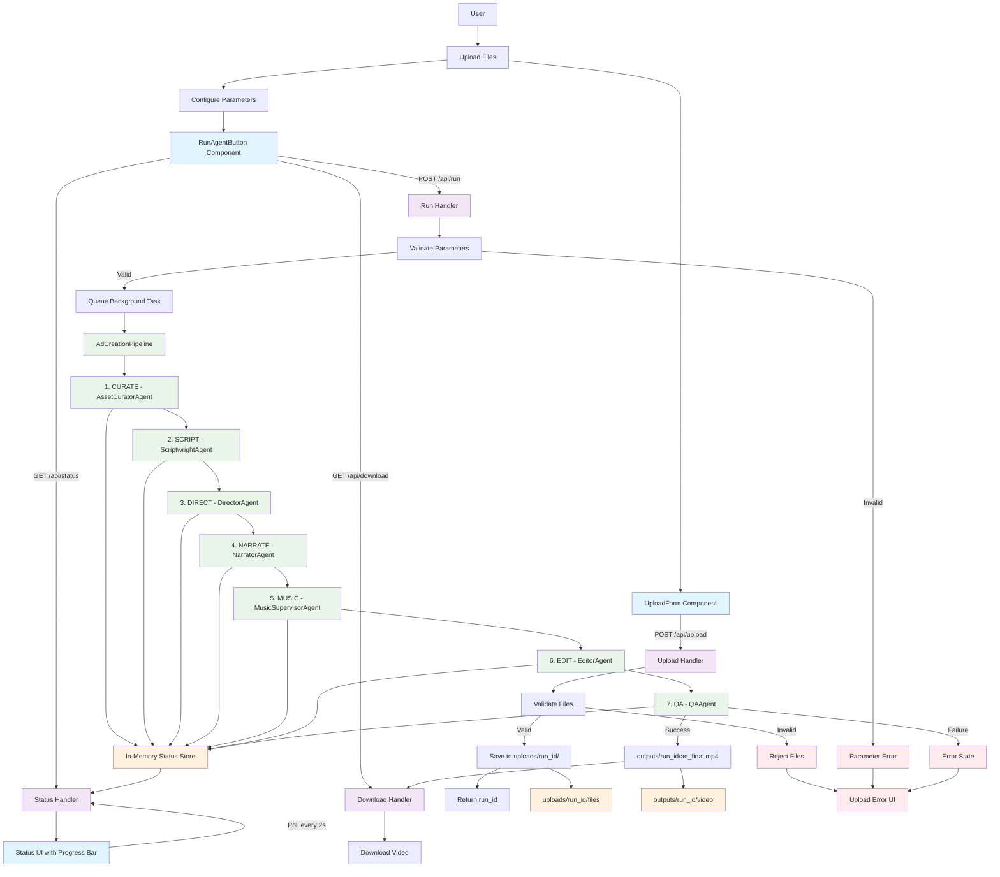

# CrewAd Flow Diagram (Legacy)

**Note: This content has been merged into the main README.md file. Please refer to README.md for the most up-to-date documentation.**

This Mermaid diagram illustrates the complete user journey from file upload to video download in the CrewAd AI-native ad studio.

## Flow Description

### Frontend Layer (Blue)
- **UploadForm Component**: Handles single/multiple file uploads with auto-categorization
- **RunAgentButton Component**: Manages pipeline configuration and real-time status monitoring
- **Status UI**: Real-time progress tracking with 2-second polling intervals

### API Layer (Purple)
- **Upload Handler**: File validation, categorization, and run_id generation
- **Run Handler**: Parameter validation and background task queuing
- **Status Handler**: Thread-safe pipeline status updates
- **Download Handler**: Final MP4 video delivery

### Pipeline Layer (Green)
7-stage AI-powered ad creation using specialized CrewAI agents:
1. **CURATE**: Asset validation, categorization, and organization
2. **SCRIPT**: RAG-enhanced ad copy generation based on tone/length parameters
3. **DIRECT**: Intelligent storyboard creation with Ken Burns motion planning
4. **NARRATE**: Voice synthesis using Kokoro TTS with espeak-ng fallback
5. **MUSIC**: Background audio supervision (MVP placeholder)
6. **EDIT**: Professional video composition using MoviePy and ffmpeg
7. **QA**: Output validation and metadata generation

### Storage Layer (Orange)
- **uploads/{run_id}/**: User-provided assets (images, logos, audio, briefs)
- **outputs/{run_id}/**: Generated videos with metadata
- **In-Memory Status Store**: Thread-safe concurrent pipeline status tracking

### Error Handling (Red)
- File type validation
- Parameter validation  
- Pipeline failure recovery
- User error messaging

## Key Technical Features

- **Asynchronous Processing**: Long-running AI pipeline executes in FastAPI background tasks
- **Real-time Status Updates**: Frontend polls pipeline status every 2 seconds
- **Multi-agent AI Architecture**: Specialized CrewAI agents for each processing stage
- **Thread-safe Concurrent Access**: Safe pipeline status tracking across requests
- **Comprehensive Error Handling**: Validation and graceful failure recovery at all stages
- **Single/Multiple File Support**: Upload individual files or batches with auto-categorization
- **Python 3.11 Compatibility**: Optimized for stable package versions and ChromaDB integration
- **Professional Video Output**: Ken Burns effects, proper audio mixing, and MP4 optimization